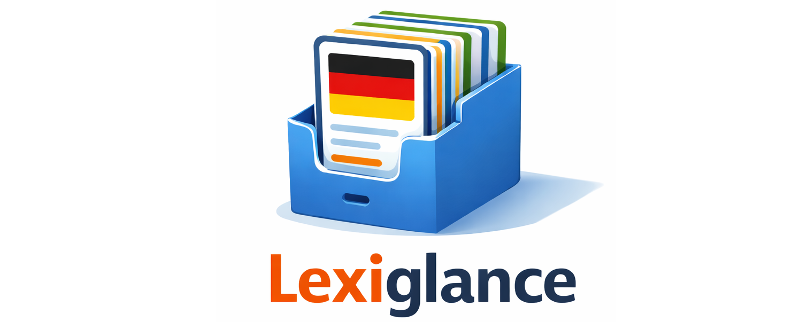

  

# Lexiglance

Lexiglance is an **Anki-based flashcard system** for learning **German vocabulary**, with cards that feel more like a mini “learning page” than a mere translation pair. The goal is not only to remember words, but to learn to **use them correctly**: in the correct context and with natural phrasing.

## Combined learning method

Lexiglance combines several learning methods that reinforce one another:

- **Spaced repetition + active recall (via Anki engine)**: you review at the right time, and you practice pulling the meaning and usage out of your memory.
- **Learning in context**: every word is used in clear, memorable example sentences and collocations and comparisons. Grammer, pitfalls, and word comparisons are clearly explained with examples.
- **Meaning-by-meaning learning**: words often have more than one meaning. Lexiglance teaches these meanings with their CEFR level (i.e A1-C2 level).

- **From understanding to speaking**: the cards highlight the common “sentence shapes” a word appears in (for example: what usually comes after it, which prepositions are common, and how it typically connects to other words).
- **Deeper memory hooks**: short notes, patterns, and connections make it easier to remember and harder to forget.
- **Learning by contrast**: similar words are shown side-by-side so you learn what’s different (this prevents the most common long-term mistakes).
- **Multimodal reinforcement**: audio and (optionally) images create extra memory pathways and improve pronunciation and recognition.

## What you learn from a Lexiglance flashcard

A Lexiglance card is structured in layers. You can skim it quickly during review, but it also gives you enough depth to truly learn the word.

### 1) The “core” of the word
You get a clear first impression of the word in action:
- a natural example sentence that shows the word in a typical situation
- helpful translations to support understanding (depending on your chosen support languages)
- essential cues that help you recognize what kind of word it is and how it behaves in everyday use

### 2) The different meanings (when a word has more than one)
If a word has multiple meanings, Lexiglance separates them into clean sections. For each meaning, you’ll typically see:
- a short, simple explanation of what that meaning expresses
- one or more example sentences that demonstrate that specific meaning
- common ways the word is used in a sentence (for example: typical prepositions, common companions, and natural phrasing)
- optional extras like common word combinations, synonyms/opposites, or quick usage tips when they genuinely help

### 3) Extra support to remember and avoid mistakes
When it adds real learning value, the card may also include:
- a helpful breakdown of the word (when it makes remembering easier)
- a small set of closely related words (useful “family” connections)
- “don’t confuse this with…” notes for common mix-ups
- short warnings about typical learner mistakes or tricky usage

## Status

This repository is currently focused on the **end-user deliverables for Anki** (templates, styles, and card-format conventions).  
The authoring/build pipeline is maintained separately for now.

## License

Lexiglance is licensed under the **Lexiglance Community License (Free Use, No Resale)**.

You are welcome to use, share, and adapt Lexiglance — including in **paid courses and tutoring** —
as long as the decks (and any modified versions) remain **free to access** and are **not resold**.
See [`LICENSE`](LICENSE) for details.

## Support

Lexiglance is **free to use**. If it helps you learn, I’d genuinely appreciate a donation to support continued development:

Thank you, and happy learning!
